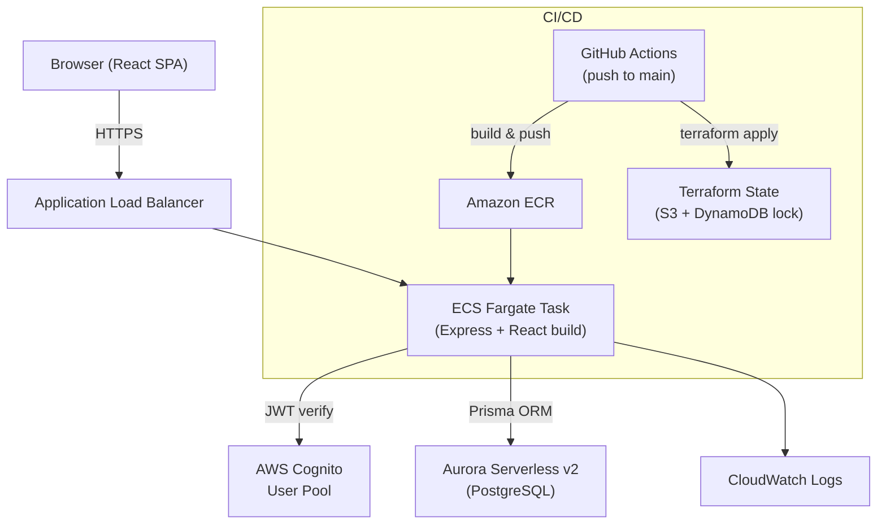

# DeterminEat — Architecture

## System Architecture



## Component Responsibilities

| Component | Responsibility |
|---|---|
| **React SPA** | User interface — restaurant list, add/edit forms, Cognito auth flow |
| **Express backend** | REST API, JWT validation, business logic, static file serving |
| **Prisma ORM** | Type-safe database access, schema migrations |
| **AWS Cognito** | User registration, authentication, JWT issuance |
| **Aurora Serverless v2** | Primary data store (PostgreSQL-compatible), scales to zero when idle |
| **ECS Fargate** | Runs the single Docker container, replaces unhealthy tasks automatically |
| **ALB** | HTTPS termination, routes traffic to ECS tasks, health checking |
| **ECR** | Docker image registry, stores tagged images per git SHA |
| **Terraform** | Declares and manages all AWS infrastructure as code |
| **GitHub Actions** | CI/CD pipeline — test, build, deploy on push to main |
| **CloudWatch Logs** | Container log aggregation and error metric filtering |
| **S3 + DynamoDB** | Terraform remote state storage and locking |

## Technology Decisions

| Concern | Choice | Rationale |
|---|---|---|
| Language | TypeScript (full-stack) | Single language across frontend and backend; strong typing catches errors early; excellent tooling ecosystem |
| Backend framework | Express | Lightweight, well-understood, minimal abstraction overhead, easy to containerize |
| ORM | Prisma | First-class TypeScript support, auto-generated type-safe client, built-in migration tooling, works great with PostgreSQL |
| Auth | AWS Cognito + `aws-jwt-verify` | Fully managed — no passwords stored in app DB; integrates naturally with AWS IAM; `aws-jwt-verify` is the official AWS library for validating Cognito JWTs |
| Database | Aurora Serverless v2 | Scales to zero when idle (low cost for personal/low-traffic use); automated snapshots built-in; PostgreSQL wire-compatible means standard Prisma support |
| Container strategy | Single image (Express serves React build) | Simplifies infra — one ECR repo, one ECS task definition, one deployment artifact; no separate CDN/S3 needed for MVP |
| Registry | Amazon ECR | Native to AWS; no extra auth complexity; integrates directly with ECS task definitions |
| Orchestration | ECS Fargate | No EC2 instances to manage; pay-per-use pricing suits low-traffic personal apps; automatic task replacement on failure |
| Load balancer | ALB | Required for ECS service discovery; handles HTTPS termination with ACM certificates; built-in health checking |
| IaC | Terraform | Declarative, stateful infrastructure management; strong AWS provider; S3 backend enables team collaboration and state locking |
| CI/CD | GitHub Actions | Native to the monorepo; secrets management built-in; free tier sufficient for personal project; straightforward YAML workflow definition |
| Monitoring | CloudWatch Logs + ECS health checks | Sufficient for personal-scale app; zero additional cost beyond log storage; ECS health checks provide automatic recovery without extra tooling |

## Repo Structure

```
determineat/
├── frontend/               # React + Vite application
│   ├── src/
│   │   ├── __tests__/      # Vitest + React Testing Library tests
│   │   ├── test/           # Test setup (jest-dom)
│   │   ├── App.tsx
│   │   └── main.tsx
│   ├── index.html
│   ├── vite.config.ts
│   ├── tsconfig.json
│   ├── .env.example
│   └── package.json
├── backend/                # Express + Prisma API
│   ├── src/
│   │   ├── __tests__/      # Jest + Supertest tests
│   │   ├── app.ts          # Express app (importable for testing)
│   │   └── index.ts        # Entry point (starts server)
│   ├── prisma/             # Added in Task 2
│   ├── Dockerfile.dev      # Local development container
│   ├── jest.config.cjs
│   ├── tsconfig.json
│   ├── tsconfig.test.json
│   ├── .env.example
│   └── package.json
├── infra/                  # Terraform infrastructure (Task 8)
│   ├── modules/
│   │   ├── vpc/
│   │   ├── ecs/
│   │   ├── aurora/
│   │   ├── cognito/
│   │   └── alb/
│   ├── main.tf
│   ├── variables.tf
│   └── terraform.tfvars.example
├── .github/
│   └── workflows/
│       └── deploy.yml      # Added in Task 9
├── docs/
│   ├── plan.md
│   └── architecture.md
├── .kiro/
│   └── steering/
│       └── documentation.md
├── docker-compose.yml      # Local development (postgres + backend)
├── Dockerfile              # Production multi-stage build (Task 7)
├── eslint.config.mjs       # Shared ESLint (flat config)
├── tsconfig.base.json      # Shared TypeScript base config
├── .prettierrc
├── .gitignore
└── README.md
```

## Data Model

```
User
├── id          String  @id  (Cognito sub)
└── restaurants Restaurant[]

Restaurant
├── id              String    @id @default(cuid())
├── userId          String    (FK → User.id)
├── name            String
├── cuisineType     String
├── googleMapsUrl   String?
├── visitDate       DateTime
├── rating          Int       (1–5)
├── wouldVisitAgain Boolean
├── notes           String?
├── createdAt       DateTime  @default(now())
└── updatedAt       DateTime  @updatedAt
```

## CI/CD Pipeline Flow

```
push to main
     │
     ▼
┌─────────────┐
│   test job  │  backend Jest + frontend Vitest
│             │  fails fast on any error
└──────┬──────┘
       │ success
       ▼
┌─────────────┐
│  build job  │  docker build (multi-stage)
│             │  docker push → ECR (tagged with git SHA)
└──────┬──────┘
       │ success
       ▼
┌─────────────┐
│ deploy job  │  terraform init + apply (injects new image tag)
│             │  force new ECS deployment
└─────────────┘
```

## Networking

```
Internet
    │
    ▼
ALB (public subnets, AZ-a + AZ-b)
    │  HTTPS :443 → HTTP :3000
    ▼
ECS Fargate Tasks (private subnets)
    │
    ├──→ Aurora Serverless v2 (private subnets, DB subnet group)
    │
    └──→ Cognito (via AWS service endpoint / internet)

VPC: 10.0.0.0/16
  Public subnets:  10.0.1.0/24, 10.0.2.0/24  (ALB, NAT Gateway)
  Private subnets: 10.0.3.0/24, 10.0.4.0/24  (ECS tasks, Aurora)
```

## Security Considerations

- ECS tasks run in private subnets with no direct internet access; outbound via NAT Gateway
- Aurora cluster is in a dedicated DB subnet group, accessible only from the ECS security group
- Cognito handles all credential management — the app never stores passwords
- JWT verification happens on every `/api/*` request using `aws-jwt-verify`
- All user data queries are scoped to the authenticated user's `sub` claim — no cross-user data access possible
- Secrets (DB connection string, Cognito config) passed to ECS via AWS Secrets Manager / Parameter Store references in the task definition
- HTTPS enforced at the ALB; HTTP redirected to HTTPS
- Terraform state encrypted at rest in S3 with versioning enabled
