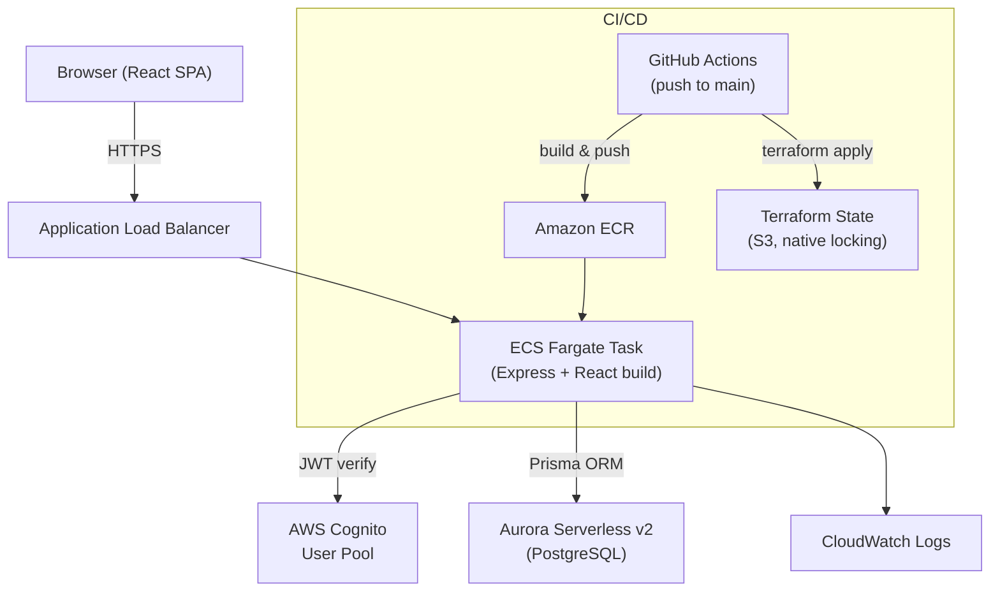

# DeterminEat — Architecture

## System Architecture



## Component Responsibilities

| Component | Responsibility |
|---|---|
| **React SPA** | User interface — restaurant list, add/edit forms, Cognito auth flow |
| **Express backend** | REST API, JWT validation, business logic, static file serving |
| **Prisma ORM** | Type-safe database access, schema migrations |
| **AWS Cognito** | User registration, authentication, JWT issuance |
| **Aurora Serverless v2** | Primary data store (PostgreSQL-compatible), scales to zero when idle |
| **ECS Fargate** | Runs the single Docker container, replaces unhealthy tasks automatically |
| **ALB** | HTTPS termination, routes traffic to ECS tasks, health checking |
| **ECR** | Docker image registry, stores tagged images per git SHA |
| **Terraform** | Declares and manages all AWS infrastructure as code |
| **GitHub Actions** | CI/CD pipeline — test, build, deploy on push to main |
| **CloudWatch** | Container logs, Container Insights metrics, error metric filter, and alarms |
| **SNS** | Delivers CloudWatch alarm notifications (email subscription) |
| **S3** | Terraform remote state storage + native state locking (`use_lockfile`) |

## Technology Decisions

| Concern | Choice | Rationale |
|---|---|---|
| Language | TypeScript (full-stack) | Single language across frontend and backend; strong typing catches errors early; excellent tooling ecosystem |
| Backend framework | Express | Lightweight, well-understood, minimal abstraction overhead, easy to containerize |
| ORM | Prisma | First-class TypeScript support, auto-generated type-safe client, built-in migration tooling, works great with PostgreSQL |
| Auth | AWS Cognito + `aws-jwt-verify` | Fully managed — no passwords stored in app DB; integrates naturally with AWS IAM; `aws-jwt-verify` is the official AWS library for validating Cognito JWTs |
| Database | Aurora Serverless v2 | Scales to zero when idle (low cost for personal/low-traffic use); automated snapshots built-in; PostgreSQL wire-compatible means standard Prisma support |
| Container strategy | Single image (Express serves React build) | Simplifies infra — one ECR repo, one ECS task definition, one deployment artifact; no separate CDN/S3 needed for MVP |
| Registry | Amazon ECR | Native to AWS; no extra auth complexity; integrates directly with ECS task definitions |
| Orchestration | ECS Fargate | No EC2 instances to manage; pay-per-use pricing suits low-traffic personal apps; automatic task replacement on failure |
| Load balancer | ALB | Required for ECS service discovery; handles HTTPS termination with ACM certificates; built-in health checking |
| IaC | Terraform | Declarative, stateful infrastructure management; strong AWS provider; S3 backend enables team collaboration and state locking |
| CI/CD | GitHub Actions | Native to the monorepo; secrets management built-in; free tier sufficient for personal project; straightforward YAML workflow definition |
| Monitoring | CloudWatch Logs + ECS health checks | Sufficient for personal-scale app; zero additional cost beyond log storage; ECS health checks provide automatic recovery without extra tooling |

## Repo Structure

```
determineat/
├── frontend/               # React + Vite application
│   ├── src/
│   │   ├── __tests__/      # Vitest + React Testing Library tests
│   │   ├── api/            # client.ts (token-authed fetch wrapper)
│   │   ├── components/     # RestaurantsPage, RestaurantList,
│   │   │                   #   AddEditRestaurant, StarRating
│   │   ├── types/          # restaurant.ts (shared types)
│   │   ├── test/           # Test setup (jest-dom)
│   │   ├── amplifyConfig.ts # Cognito/Amplify configuration
│   │   ├── vite-env.d.ts   # Typed VITE_ env vars
│   │   ├── App.tsx         # Authenticator + authenticated shell
│   │   └── main.tsx        # Amplify.configure + Authenticator.Provider
│   ├── index.html
│   ├── vite.config.ts
│   ├── tsconfig.json
│   ├── .env.example
│   └── package.json
├── backend/                # Express + Prisma API
│   ├── src/
│   │   ├── __tests__/      # Jest + Supertest tests
│   │   ├── lib/            # prisma.ts (client singleton)
│   │   ├── middleware/     # auth.ts (Cognito JWT verification)
│   │   ├── routes/         # me.ts, restaurants.ts
│   │   ├── schemas/        # restaurant.ts (Zod validation)
│   │   ├── services/       # restaurant.ts (user-scoped DB logic)
│   │   ├── types/          # express.d.ts (Request augmentation)
│   │   ├── app.ts          # Express app (importable for testing)
│   │   └── index.ts        # Entry point (starts server)
│   ├── prisma/             # schema.prisma + migrations
│   ├── Dockerfile.dev      # Local development container
│   ├── jest.config.cjs
│   ├── tsconfig.json
│   ├── tsconfig.test.json
│   ├── .env.example
│   └── package.json
├── infra/                  # Terraform infrastructure
│   ├── modules/
│   │   ├── vpc/            # VPC, subnets, IGW, NAT, routes
│   │   ├── ecr/            # container registry + lifecycle policy
│   │   ├── cognito/        # user pool + public app client
│   │   ├── aurora/         # Serverless v2 PostgreSQL + secret
│   │   ├── alb/            # load balancer, target group, listeners
│   │   ├── ecs/            # cluster, task def, service, IAM, logs
│   │   ├── monitoring/     # error metric filter, SNS alerts, alarms
│   │   └── github_oidc/    # data-source lookup of the CI/CD deploy role
│   ├── main.tf             # module wiring
│   ├── variables.tf
│   ├── outputs.tf
│   ├── security_groups.tf  # tasks SG (root-level, breaks module cycle)
│   ├── versions.tf         # providers + S3 backend (native locking)
│   ├── bootstrap.py        # one-time: state bucket + OIDC provider + role
│   ├── terraform.tfvars.example
│   └── backend.hcl.example
├── .github/
│   └── workflows/
│       └── deploy.yml      # CI/CD: test → build → deploy (OIDC auth)
├── docs/
│   ├── plan.md
│   ├── architecture.md
│   └── cognito.md          # Cognito setup, token model, verification
├── .kiro/
│   └── steering/
│       └── documentation.md
├── docker-compose.yml      # Local development (postgres + backend)
├── Dockerfile              # Production multi-stage build (SPA served by Express)
├── .dockerignore
├── eslint.config.mjs       # Shared ESLint (flat config)
├── tsconfig.base.json      # Shared TypeScript base config
├── .prettierrc
├── .gitignore
└── README.md
```

## Data Model

```
User
├── id              String    @id  (Cognito sub)
├── createdAt       DateTime  @default(now())
└── restaurants     Restaurant[]

Restaurant
├── id              String    @id @default(cuid())
├── userId          String    (FK → User.id, cascade delete)
├── name            String
├── cuisineType     String
├── googleMapsUrl   String?
├── visitDate       DateTime  @db.Date
├── rating          Int       (1–5)
├── wouldVisitAgain Boolean
├── notes           String?
├── createdAt       DateTime  @default(now())
└── updatedAt       DateTime  @updatedAt

Indexes: restaurants(userId)
```

## API Endpoints

All `/api/*` routes require a valid Cognito access token in the
`Authorization: Bearer <token>` header. Every query is scoped to the
authenticated user's `sub` claim, so users can only ever see their own data.

| Method | Path | Auth | Description | Success |
|---|---|---|---|---|
| GET | `/health` | none | Liveness check for ECS/ALB | 200 |
| GET | `/api/me` | required | Returns `{sub, username, email}` from the token | 200 |
| GET | `/api/restaurants` | required | List the user's restaurants (newest visit first) | 200 |
| POST | `/api/restaurants` | required | Create a restaurant | 201 |
| GET | `/api/restaurants/:id` | required | Fetch one restaurant | 200 |
| PUT | `/api/restaurants/:id` | required | Update a restaurant (partial body allowed) | 200 |
| DELETE | `/api/restaurants/:id` | required | Delete a restaurant | 204 |

Error responses:
- **400** — request body fails Zod validation (returns `{error, details}`)
- **401** — missing, malformed, or invalid token
- **404** — record not found *or* owned by a different user (existence is not leaked)
- **500** — unhandled error (caught by the global error handler)

## CI/CD Pipeline Flow

Defined in `.github/workflows/deploy.yml`. Runs on push to `main` (and the
`test` job also on PRs). Authenticates to AWS via GitHub OIDC — no long-lived
AWS keys are stored in GitHub. Runner tooling is pinned: Node via
`setup-node@v4`, Terraform via `hashicorp/setup-terraform@v3` (GitHub runners
do not ship Terraform).

```
push to main (test also runs on PRs)
     │
     ▼
┌─────────────┐
│   test job  │  npm ci; start postgres_test; apply migrations
│             │  typecheck + lint + test (Jest + Vitest)
└──────┬──────┘
       │ success (main only)
       ▼
┌─────────────┐
│  build job  │  OIDC → ECR login
│             │  docker build (VITE_* Cognito vars as build args)
│             │  push → ECR, tagged with git SHA + latest
└──────┬──────┘
       │ success
       ▼
┌─────────────┐
│ deploy job  │  OIDC; setup-terraform (pinned)
│             │  terraform init -backend-config; apply w/ new image URI
│             │  ecs update-service --force-new-deployment; wait stable
└─────────────┘
```

Auth: `infra/bootstrap.py` creates the OIDC provider and a deploy IAM role whose
trust policy is scoped to `repo:<owner>/<repo>:ref:refs/heads/main` (Terraform
only references the role via a data source, since it must exist before the
OIDC-authenticated pipeline can run Terraform). Terraform state locking is
native to S3 (`use_lockfile`), so no DynamoDB table is used.
Database migrations are **not** a pipeline step — the container runs
`prisma migrate deploy` on startup, and the runner cannot reach the
private-subnet Aurora instance anyway.

## Networking

```
Internet
    │
    ▼
ALB (public subnets, AZ-a + AZ-b)
    │  HTTPS :443 → HTTP :3000
    ▼
ECS Fargate Tasks (private subnets)
    │
    ├──→ Aurora Serverless v2 (private subnets, DB subnet group)
    │
    └──→ Cognito (via AWS service endpoint / internet)

VPC: 10.0.0.0/16
  Public subnets:  10.0.1.0/24, 10.0.2.0/24  (ALB, NAT Gateway)
  Private subnets: 10.0.3.0/24, 10.0.4.0/24  (ECS tasks, Aurora)
```

## Monitoring & Alerting

Provisioned by the `monitoring` module (see the operational runbook in the
README for day-to-day commands):

- **Logs** — the app emits structured JSON (one line per event with a `level`
  field). ECS ships stdout/stderr to the `/ecs/determineat` CloudWatch log group.
- **Error metric** — a metric filter matches `level = "ERROR"` lines and counts
  them as `DeterminEat/AppErrorCount`.
- **Alerts** — an SNS topic (`determineat-alerts`) with an optional email
  subscription receives alarm notifications.
- **Alarms** — application errors (≥ 5 in 5 min), ECS CPU > 85%, ECS memory
  > 85%, and unhealthy ALB targets (≥ 1 for 3 min).
- **Self-healing** — the ALB/ECS `/health` check (30s interval, 3 failures =
  unhealthy) makes Fargate replace bad tasks automatically. On startup the app
  retries the Aurora connection with exponential backoff to ride out
  Serverless v2 cold-starts rather than crash-looping.

## Security Considerations

- ECS tasks run in private subnets with no direct internet access; outbound via NAT Gateway
- Aurora cluster is in a dedicated DB subnet group, accessible only from the ECS security group
- Cognito handles all credential management — the app never stores passwords (see [`cognito.md`](cognito.md) for the full setup and token model)
- JWT verification happens on every `/api/*` request using `aws-jwt-verify`
- All user data queries are scoped to the authenticated user's `sub` claim — no cross-user data access possible
- Secrets (DB connection string, Cognito config) passed to ECS via AWS Secrets Manager / Parameter Store references in the task definition
- HTTPS enforced at the ALB; HTTP redirected to HTTPS
- Terraform state encrypted at rest in S3 with versioning enabled
